<!-- *********************************************************************** -->
<!--                                                                         -->
<!--                                         =@@*   +@@+                     -->
<!--                                         =@@*   +@@+ :*%@@@%*:           -->
<!--                                         =@@*   =@@+.@@@=--%@@-          -->
<!--                                         :@@%. .#@@--@@*   +@@* .+%@@@   -->
<!-- README.md                                =%@@@@@@+ =@@*   =@@+.@@@+-=   -->
<!--                                            .---:   -@@#.  *@@--@@*      -->
<!-- By: aperez-b <aperez-b@uoc.edu>                     +@@@@@@@* +@@+      -->
<!--                                                       :-==:.  -@@#      -->
<!-- Created: 2023/03/28 12:35:14 by aperez-b                       +@@@%@   -->
<!-- Updated: 2023/06/15 15:01:52 by aperez-b                                -->
<!--                                                                         -->
<!-- *********************************************************************** -->

# Practical 1. Watch the network and you will find out what is going on there

## Table of Contents

- [Part 1 Link and Network Layers](#part-1-link-and-network-layers)
	- [Exercise 1](#exercise-1)
	- [Exercise 2](#exercise-2)
	- [Exercise 3](#exercise-3)
- [Part 2 Transport Layer](#part-2-transport-layer)
	- [Exercise 1](#exercise-1-1)
	- [Exercise 2](#exercise-2-1)
	- [Exercise 3](#exercise-3-1)
- [Part 3 Application Layer](#part-3-application-layer)
	- [Exercise 1](#exercise-1-2)
	- [Exercise 2](#exercise-2-2)
	- [Exercise 3](#exercise-3-2)

## Part 1 Link and Network Layers

### Exercise 1

Click over a specific frame from the capture you have done with Wireshark. Check that
it includes the Ethernet header with data from the link layer. Show via a screenshot the
Ethernet header contents. Respond to the following questions:

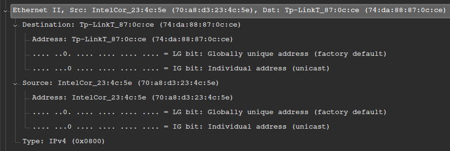

#### a) What are source and destination addresses? Who do you think they belong to?

src address: `70:a8:d3:23:4c:5e` belongs to my network adapter.

dst address: `74:da:88:87:0c:ce` belongs to my Wi-Fi router.

#### b) Who assigns these addresses?

In both cases it is the hardware manufacturer that assigns these addresses. In the
case of my PC it is assigned to my Network Interface Controller (NIC).

#### c) What does type field mean?

The *type* field defines the type of network-layer protocol to use in a given
Ethernet frame. This field is analogous to the *protocol* field of the network-layer
datagram and to the *port-number* filed from the transport-layer segment.

#### d) Which function has the CRC field? Respond in a theoretical way.

The Cyclic Redundancy Check or *CRC* is an error-detection mechanism based on
polynomial codes that ensures the integrity of a given piece of data.

Consider the following:

- A set of *d*-bits from the Data *D*
- A Generator bit pattern *G* which consists of *r + 1* bits to form *R* known by both the sender and
the receiver. The most significant bit of *G* will always be a *1*.

From these two values we extract the following formula:

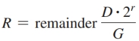

#### e) What is the purpose of the preamble in an Ethernet frame?

The preamble consists of *8 bytes* of data in which the first seven bytes
contain `10101010` and the eight one has `10101011`. This helps the receiving
adapters to realize that data is about to come in, as well as helps sync the
sender's and receiver's clocks so that the receiver can 'lock' onto the sender.
The last two bits of the preamble (`11`) are the final wake-up call to warn
that actual data is about to be received next.

#### f) What data does this Ethernet frame carry?

The Ethernet frame consists of the following:

- Preamble
- Destination address
- Source address
- Type field
- Data payload and padding
- CRC

### Exercise 2

In the previous frame, notice that the detail of an IP header is also included. Show via a
screenshot the IP header contents. Respond to the following questions

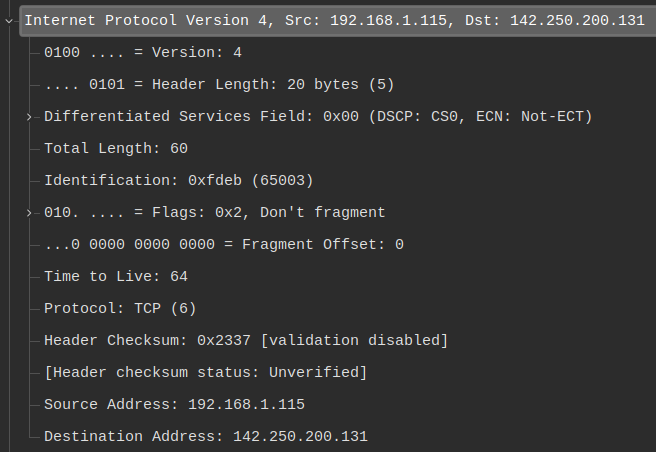

#### a) What are source and destination addresses? Who do you think they belong to?

src address: `192.168.1.115` is the IP address of my computer on my home network

dst address: `142.250.200.131` is the public address of the destination website
I want to access (google.com)

#### b) Why does the packet have an identifier?

Because of fragmentation in IPv4, packets are identifed with an identifier,
which is set by the sender and typically incremented for every packet. This is
done so that the receiver can verify that the packets all arrive and do so in the
proper order, as well as to determine which fragments belong to a given datagram.

#### c) Which flags are active in this packet?

The only active flag is `0x2 Don't fragment` 

#### d) Explain what the TTL value means in the analyzed packet.

The Time to Live or TTL for this particular frame is `64`. This means
that the data in this frame will travel up to `64` nodes in the network
before reaching my computer, otherwise it will be discarded by the router.

#### e) Why is a checksum field needed again in the IP protocol?

In order to verify the integrity of the transmitted frames.

#### f) Go to menu Statistics > IPv4 statistics > IP protocol types. Which is the protocol sending more packets? Why?

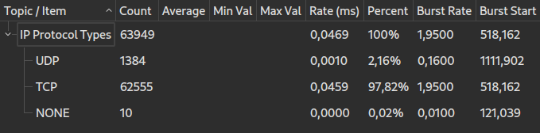

Clearly TCP is sending more packets because it is proven to be reliable, secure,
and has error detection and correction features. Other Internet protocols such as
UDP have no handshake, and can be less secure or reliable. One good use case of UDP
could be video calls.

### Exercise 3

Finally, without applying any filters, go to the statistics menu Statistics > Protocol
Hierarchy. Show in a screenshot the results and comment them, relating them with
packet encapsulation and de-encapsulation, a fundamental pillar of network
communications.

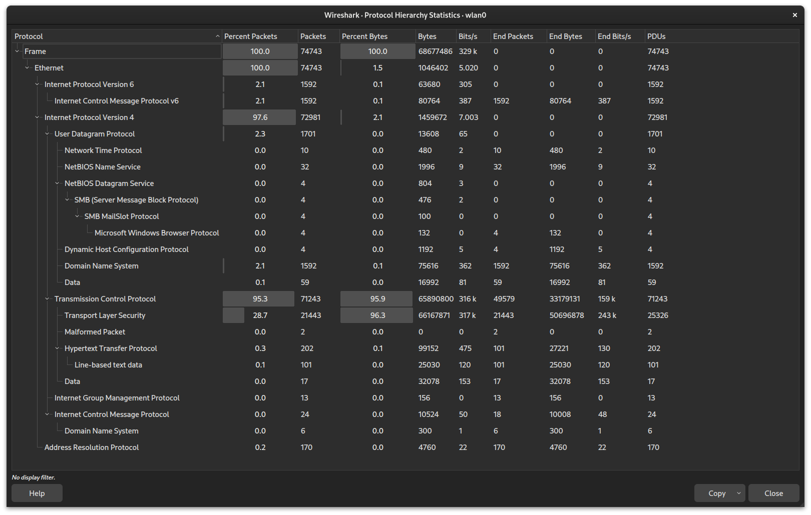

We can see from the satistics above that IPv4 is still the most widely used version of the
IP protocol, whereas IPv6 only accounts for `2%` of my computer's traffic. Focusing on
IPv4, we see that about `95%` of the traffic goes to the *TCP* (Transmission Control Protocol)
whereas only `2%` is related to *UDP* (User Datagram Control). This is largely due to the fact
that TCP has mechanisms for ensuring security between two communication ends, using a handshake
between the two parties before transmitting any payload. Also, thanks to TCP's packet fragmentation,
TCP packets can scale very well on slower networks, ensuring that every fragment of a packet is received
by the receiver in the right order and has little odds of bit corruption.

## Part 2 Transport Layer

### Exercise 1

First of all, you have to analyze the UDP protocol. You can filter this protocol in Wireshark
and you will only see packets from this protocol. Show via a screenshot the header fields
and respond to the following questions:

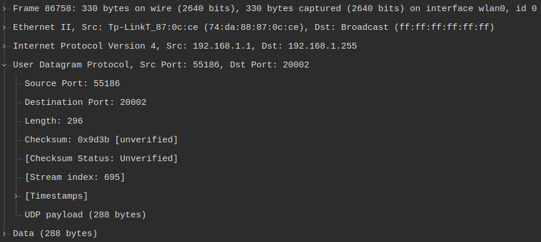

#### a) Which protocol/s from the application layer has/have generated these packets?

Judging by the destination port, it seems like this corresponds to an *HTTP* request.

#### b) Why do you think UDP is used instead of TCP?

TBA

#### c) Why do values have source and destination ports? What does it mean?

Ports are used in UDP to determine the type of network service to be used.
The destination port refers to the desired network services, whereas the source
port is typically randomized by the system, and is used to create a session for
such network service.

#### d) Why is the checksum field required?

Because UDP is a best-effort connectionless protocol, it does not care if
packets are dropped, if they are corrupted or if they are sent in an incorrect order.
However, UDP provides a checksum field that only verifies the integrity of the packages,
but does not provide any sort of error correction, unlike TCP.

#### e) How is it calculated?

All the segments of the payload are added up and then turned into the complementary,
i.e. turning all the `1`s into `0`s and all the `0`s into `1`s. The receiver would then
do the same sum and check that the calculated checksum and the original checksum match.

#### f) What is the value of the length field? Check with hexadecimal values of the UDP packet that this is the value indeed.

The *length* field value is 296.

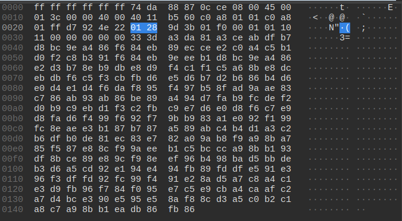

From the screenshot above, the hexadecimal code for the *length* field is `01 28` which
represents `296` in decimal

### Exercise 2

Next, we have to check how the TCP protocol works. Go to the statistics menu Statistics
> Flow Graph, and select only TCP type, checking the option Flow type > TCP flow.
Show in a screenshot the phases where the connection is established and finished.
Explain the process. What is the flag PSH used for?

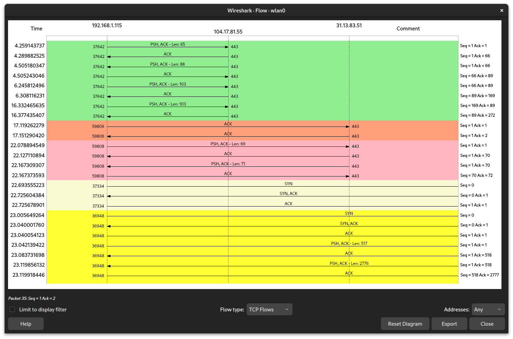

The *PSH* flag is used to ensure that data is transmitted as soon as possible,
rather than waiting for the buffer to store more data to fill a packet. The receiving
end is also notified that this data is to be pushed to the application as soon
as possible.

### Exercise 3

Go to the main packets list. You can filter using TCP protocol to see only packets
concerning this protocol. Select a packet and show in a screenshot the TCP header fields
content and respond to the following questions:

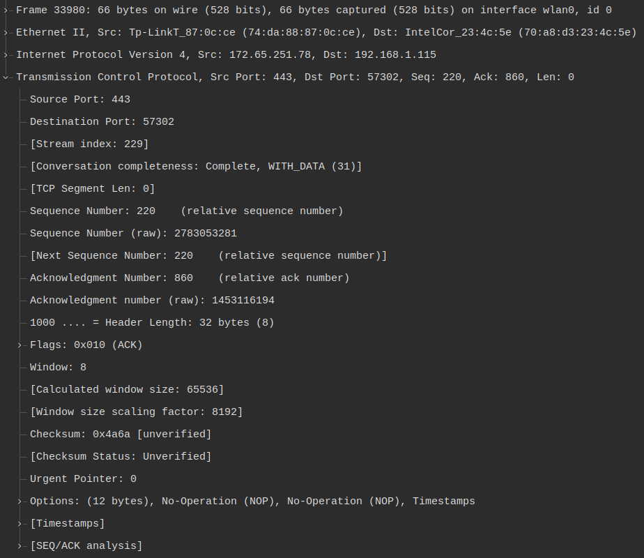

#### a) Which is the sequence number? What is it used for?

The sequence number is `220` and it is used in TCP to identify
a packet to be transmitted and keep track how much data is yet
to be transmitted. The *seq* (sequence number) is sent in a packet,
and the receiver confirms that it has correctly received the
packet by sending and *ack*.

#### b) And the ACK number?

The *ack* (acknowledgement) is the code sent from the receiver back
to the sender to indicate if the sent data is corrupt or otherwise
invalid, or if it has received it correctly. If the packet has been
correctly received, the *ack* is the sequence number of the next
packet that is expected to be transmitted by the sender. The *ack*
for this transmission is `860`.

#### c) Which values have source and destination ports? What does it mean?

Source Port: 443

Destination Port: 57302

Similarly to UDP, the source port refers to a port generated from the computer
to create a session to be used in a destination port representing a specific
network application.

#### d) Which flags are active in this packet?

The only active flag for this package is the *ACK* flag, as this corresponds
to an *ack* message.

#### e) Explain what the values relative to the window mean.

The TCP window refers to the maximum number of segments that can be transmitted
by the sender before an *ack* is returned.

#### f) Which data does this TCP packet carry?

This TCP packet carries no payload, as it only confirms with an *ack* that
the last packet was sent successfully.

## Part 3. Application Layer

### Exercise 1

First of all, you have to analyze a DNS header from a request and a response, so you
can filter in Wireshark by DNS protocol and you will see only packets from this protocol.
Show a screenshot with the header fields and respond to the following questions:

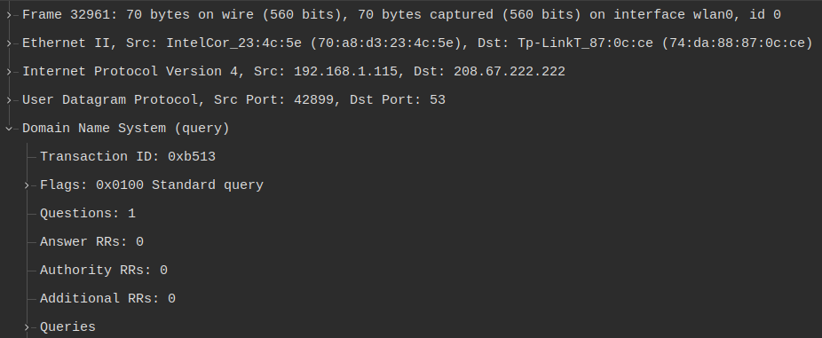

#### a) Which source and destination ports are used?

src: 42899 (UDP)

dst: 53 (UDP)

#### b) What is the transaction identifier for?

It is used to identify a query for a domain, which can later be remembered to prevent asking
over and over for the same domain.

#### c) What do flags mean?

The flags explain that it is a standard query, done recursively, and that the response message
is not to be truncated.

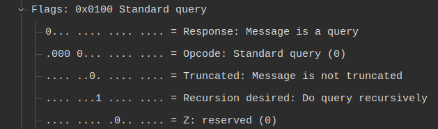

#### d) In the request, which domain is requested?

google.com

#### e) Which kind and class this domain is? What does it mean?

Type A: Corresponds to a Host Address

Class IN : Refers to an INternet query

#### f) Can there be multiple records (RR, resource records) in the response?

Not for this query.

### Exercise 2

Now analyze an HTTP header from a GET request. Show a screenshot with the header
fields and respond to the following questions:

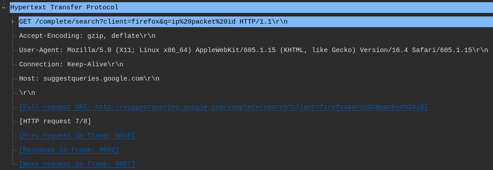

#### a) Which source and destination ports are used?

src: 53148 (TCP)

dst: 80 (TCP)

#### b) Which is the version of the HTTP protocol?

HTTP Version 16.4

#### c) Are persistent connections used?

Yes, as connection is set to *Keep-Alive*

#### d) Which language is used? Why is it provided?

TBA

#### e) Which kind of content could be processed?

TBA

#### f) Which coding formats are used?

TBA

### Exercise 3

Analyze an HTTP header of a successful GET response. Show a screenshot with the
header fields and respond to the following questions:

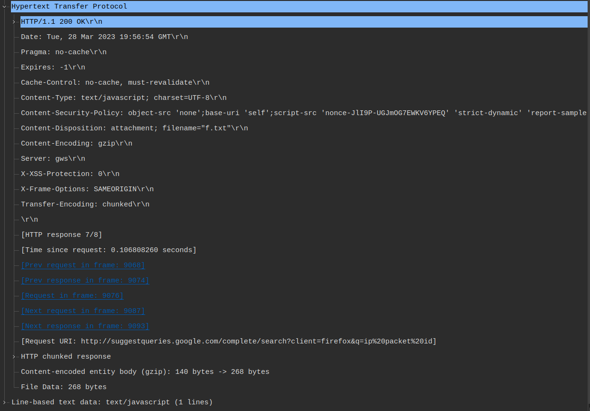

#### a) What does this response contain?

It contains some extra information like the date or expiration date,
but mainly it contains a Javascript snippet code with the answer to the
query.

#### b) Which kind of content does it contain?

Line-Based Text data.

#### c) Is the content fragmented? How do we know?

It is, because the header gives us information on the different
chunks of data and the encoding for the end.

#### d) Which fields are related to dates? What do they mean?

Date: date of the response

Expires: whether the response is set to automatically expire

#### e) Are cookies used? How do they work?

TBA

#### f) Describe what the fields related to caches mean.

TBA

### Exercise 4

Go to the Wireshark statistics menu Statistics > HTTP > Packet counter. Show a
screenshot where the unsuccessful responses received are seen (they have value Count
> 0). Describe what each error code means and how many packets of each packet have
been received. Afterwards, select an error code and look for it on the main packet capture
screen. Show a screenshot with the header fields with a brief explanation.

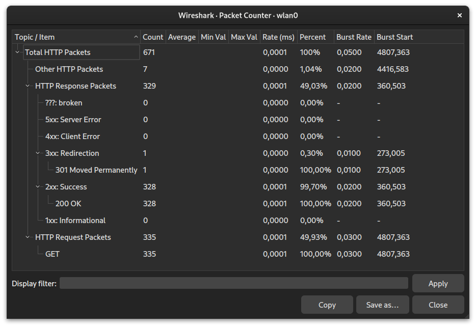

March 28th, 2023
