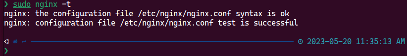
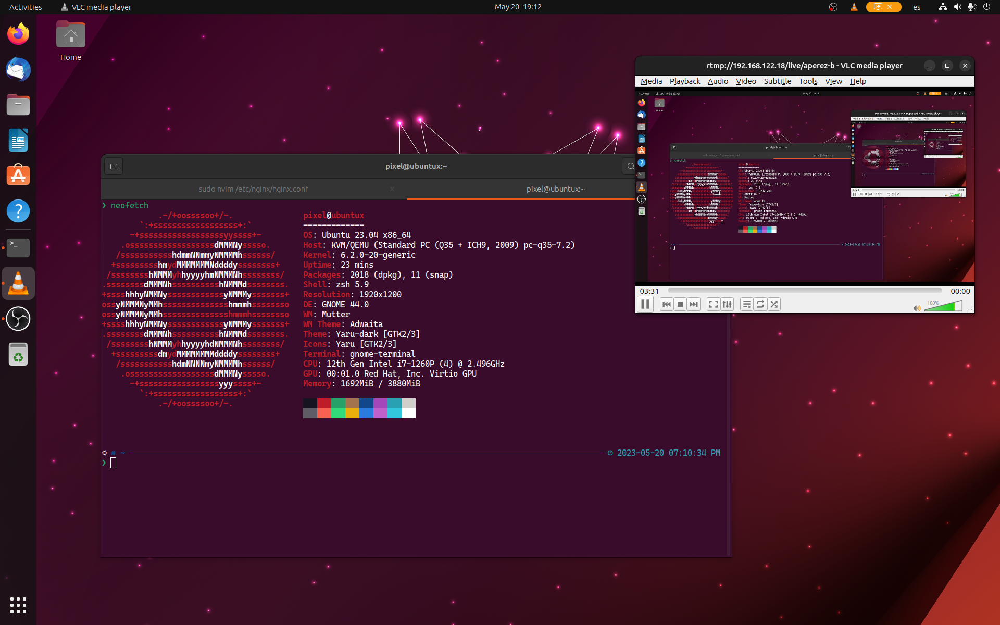

<!-- *********************************************************************** -->
<!--                                                                         -->
<!--                                         =@@*   +@@+                     -->
<!--                                         =@@*   +@@+ :*%@@@%*:           -->
<!--                                         =@@*   =@@+.@@@=--%@@-          -->
<!--                                         :@@%. .#@@--@@*   +@@* .+%@@@   -->
<!-- README.md                                =%@@@@@@+ =@@*   =@@+.@@@+-=   -->
<!--                                            .---:   -@@#.  *@@--@@*      -->
<!-- By: aperez-b <aperez-b@uoc.edu>                     +@@@@@@@* +@@+      -->
<!--                                                       :-==:.  -@@#      -->
<!-- Created: 2023/05/20 11:10:01 by aperez-b                       +@@@%@   -->
<!-- Updated: 2023/05/20 23:19:14 by aperez-b                                -->
<!--                                                                         -->
<!-- *********************************************************************** -->

# Practical 3: Experimenting with continuous reproduction

## Table of Contents

- [Part 1](#part-1)
  - [Exercise 1](#exercise-1)
- [Part 2](#part-2)
  - [Exercise 2](#exercise-2)
- [Part 3](#part-3)
  - [Exercise 3](#exercise-3)
  - [Exercise 4](#exercise-4)
- [Part 4](#part-4)
  - [Exercise 5](#exercise-5)

## Part 1

### Exercise 1

a) **Explain all the RTMP configuration parameters you added in the previous nginx.conf configuration file.**

Here's an explanation of each parameter:

- `server`: define a server block within the RTMP module.
- `listen 1935`: specify that the server should listen for incoming RTMP connections on port 1935.
- `chunk_size 4096`: set the chunk size for RTMP packets to 4096 bytes.
- `allow publish all`: allow anyone to publish data to this RTMP server.
- `application live`: define an application block named *live* within the server block.
- `live on`: enable live streaming for the *live* application.
- `record off`: disable recording of the stream.

b) **Add three more RTMP-related configuration parameters and explain why you think they
are interesting to take them into account. Show a screenshot of the `nginx.conf` file
where they appear.**

- `max_streams`: The maximum number of streams that can ever be active on a specific RTMP server is specified by this parameter. Setting the right value for this parameter is crucial since having too many active streams can compromise server performance or possibly cause it to crash. You may make sure that your server operates smoothly and effectively by restricting the amount of active streams.
- `timeout`: This parameter specifies the amount of time in seconds that an RTMP client has to establish a connection with the server before the connection times out. To avoid stopped connections consuming server resources and negatively affecting server performance, it is crucial to establish an adequate timeout setting. The server can deal with unsuccessful connection attempts more quickly and free up resources with a shorter timeout setting.
- `buffer_size`: This parameter determines the size of the buffer used to store incoming data before it is processed by the server. Making sure that data streams effectively and uninterruptedly requires setting an adequate buffer size. If the buffer size is too tiny, the server may have buffering problems, which will reduce the quality of the streaming. On the other hand, excessively large buffer sizes may result in increased latency and delayed streaming.

Here is a screenshot showing these parameters on my `nginx.conf` file:

Here is the output of `ngninx -t` after adding the three parameters:

c) **To verify that nginx is working correctly, type the following order in the console and display
the result using a screenshot**

Here is a screenshot showing the status of the `nginx` service:

d) **On which IP address is the RTMP server running? Check it with the `ifconfig` command
or any other similar tool, showing with a screenshot.**

Here's the output of the `ip a` command, an alternative to `ifconfig`:

Our nginx server is running locally on our host IP `127.0.0.1` (localhost) and on the IP
address of the device on the Wi-Fi I am using (`192.168.122.18`).

e) **On which port is the RTMP server running? In what state are you? Check it with the
`netstat` command or any other similar tool, displaying it using a screenshot.**

From the screenshot above, we can see that nginx is running our RTMP server on `0.0.0.0:1935`, i.e. it is listening on all
addresses and using port 1935, as specified in the config file. This IP is used so that any external device can connect to
the server, either on a local network or over the internet.

f) **In any web browser, enter the following URL `http://<your_server_ip>`. Show by
screenshot that the web server is properly configured.**

Here is the screenshot:

## Part 2

### Exercise 2

a) **Explain the meaning of all the options in the previous `ffmpeg` command.**

Here's what each option means:

- `-re`: reads the input file at its native frame rate.
- `-i "<downloaded file name>"`: specifies the input file's path.
- `-c:v copy`: copies the video codec from the input to the output without re-encoding, saving time and preserves quality.
- `-c:a aac`: sets the audio codec to AAC, which is a commong choice for streaming.
- `-ar 44100`: sets the audio sampling rate to 44.1 kHz, which is the standard for high-quality audio.
- `-ac 1`: sets the number of audio channels to 1 (mono).
- `-f flv`: specifies the output container format as Flash Video (FLV), which is commonly used for online video streaming.
- `–flvflags no_duration_filesize`: sets some flags for the FLV output to prevent it from including information about the file size and duration, which can be useful for live streaming as it makes the transmission faster.
- `rtmp://localhost/live/stream`: specifies the destination RTMP server URL and the stream name where the data will be sent.

b) **Explain why the `live` and `stream` words appear in the URL we are sending the video to.**

Our RTMP app is called `live`, and the stream is the live flow of video being cast over the network. Thus, we are replaying a video's live stream, which is part of out `live` application.

c) **How many frames per second is the video stream?**

Same as the original file, about `24fps`.

d) **Connect with `VLC` or any other player to the URL `rtmp://<your_server_ip>/live/stream` while the video is uploading with the
`ffmpeg` streaming program. Paste a screenshot showing that the video is playing.**

Here is a screenshot proving that the video is playing from `VLC`:

e) **The broadcast will end when the video stops. What would need to be done to loop it?**

To loop the video one must specify the `-stream_loop` option, followed by the number of loops or `-1` to loop indefinitely.

f) **What is the average bitrate to which it has been transmitted?**

The average bitrate is about `1179kbits/s`.

## Part 3

### Exercise 3

a) **To verify that streaming is being streamed in real time, connect to `VLC` or similar to the URL
`rtmp://<your_server_ip>/live/<user_uoc>`. Show it using a screenshot.**

Here is a screenshot of my sample stream:

b) **Perform user actions on the screen where you are running OBS and watch in the streaming
you are viewing with VLC or similar. What are you relaying?**

I can see that the video being transmitted from my Ubuntu system has a `10` second delay,
more or less. Also, internal audio cannot be heard from VLC since no audio capture device has
been selected on OBS.

c) **Think of a video to play that contains at least three scenes with multiple sources. Explain
your idea and show through screenshots the OBS settings and streaming playback with `VLC`.**

As an example, I can share three different screens. One contains the video we downloaded before, which is looped.
Then we have another scene which shares a game window, and lastly we have a third scene which shows the system resources.
I am thinking that a good use case for this setup would be for a user to stream the window of the `supertux` game,
and during short intermissions he could show the third scene with the window of a terminal running the `top` command, and for longer
breaks instead of stopping the stream the streamer could leave the video in an endless loop until he comes back. The
user could keep a window always on top to easily switch between scenes.

Here is a couple of screenshots showing how the setup would look. I used VLC to show the stream live, during a real stream
this window would represent what the users are seeing on their screens.

d) **Open the Wireshark program as root before starting the live stream. Paste a screenshot
showing the RTMP traffic generated. You can filter by RTMPT protocol to see only this
interaction. Explain reasonably, packet by packet, the first phase of connection establishment
(handshake) with parameter negotiation (up to the audio/video data packets).**

Here is a screenshot of the first phase of the connection when streaming with RTMP:

The first phase of the connection is the handshake, which ensures the identity of both the sender and receiver before
transmitting the stream. This handshake is divided in 6 packets (`C0`, `C1`, `S0`, `S1`, `S2`, `C2`), as follows:

- The client sends a `C0` message to the server. This is a one-byte packet that identifies the version of the RTMP protocol being used.
- The server responds with an `S0` message. Like the `C0` message, this is also a one-byte packet that identifies the RTMP version being used.
- The client sends a `C1` message to the server. This packet includes a `1536-byte` client-generated random number and a timestamp that shows when the message was sent. The client also includes a copy of its IP address, version information, and other information in this packet.
- The server responds with an `S1` message. This packet includes a `1536-byte` server-generated random number and a timestamp that shows when the message was sent. The packet also contains copies of the server's version information, IP address, and other information.
- The client sends a `C2` message to the server. This packet includes the client's own random number, the server's original random number from the `S1` message, and yet another timestamp. This enables the server to check if the client actually received the right random number.
- The server responds with an `S2` message. This packet includes the server's own random number, another timestamp, and the client's initial random number that was sent in the `C1` communication. This enables the client to confirm that the server correctly received its random number.

After successfully exchanging all six packets, the client and server can be certain of one another's identities and are prepared to proceed to the following stage of the RTMP connection.

e) **Stop streaming on VLC and OBS. What packages are generated in Wireshark? Briefly
explain the interaction you observe, illustrating it with some screenshot.**

Here is a screenshot of the last RTMP packets:

From the screenshot, we see that the last few packets are ending the interaction. The following operations are called:

- `FCUnpublish()`: This function is used to unpublish a stream from an RTMP server. When a publisher wants to stop streaming, they can call this function to notify the server that they want to stop publishing data.
- `deleteStream()`: This function is used to end a streaming session. The server will send out a notification to other clients informing them that the stream has stopped.
- `onStatus()`: This function is a callback method that is called by an RTMP server to notify a client of changes in the status of a streaming session. For instance, the server may send a "onStatus" message to notify that a stream has been paused if it is interrupted due to network problems. In this case, the notification is that the stream has ended.

### Exercise 4

Display a screenshot with your browser’s access to the RTMP statistics page:
`http://<server_ip>:8080/stat` and update it while streaming video stored with VLC
connected. See how streaming statistics change. If not, restart VLC to view them.

Answer the following questions:

a) **In relation to the audio transmission, indicate:**

1. What codec is being used? `AAC LC`
1. What is the bitrate? `75Kb/s`
1. What is the frequency? `44100`
1. And the channel? `1`

b) **In relation to video streaming, please indicate:**

1. What codec is being used? `H264 High 3.1`
1. What is the bitrate? `984 Kb/s`
1. At what resolution is it being transmitted? `1280x720`
1. At how many frames per second? `23`

## Part 4

### Exercise 5

a) **Explain all the RTMP configuration parameters you added to the two previous
configuration files.**

- `nginx.conf`:
  - `hls on`: enables HLS streaming for the `live` application.
  - `hls_path /var/www/html/stream/hls`: specifies the file path where the HLS segments will be stored.
  - `hls_fragment 3`: specifies the duration of each HLS segment, in seconds.
  - `hls_playlist_length 60`: specifies the length of the HLS playlist in seconds. The playlist is an index file that lists all the available HLS segments.
  - `dash on`: enables the DASH streaming format for the application (similarly to `hls on`).
  - `dash_path /var/www/html/stream/dash`: This specifies the file path where the DASH segments will be stored (similarly to `hls_path`).
- `/etc/nginx/sites-available/rtmp`:
  - `listen 8088`: listens on port `8088` for incoming HTTP connections.
  - `location /`: specifies how to handle requests for URLs starting with `/`.
  - `add_header Access-Control-Allow-Origin *`: This adds an HTTP header named "Access-Control-Allow-Origin" to the response. The value of `*` allows any domain to access the resources in this path.
  - `root /var/www/html/stream`: sets the root directory from which files will be served. E.g. when a request is made for `example.mp4`, Nginx will look for the file at `/var/www/html/stream/example.mp4`.
  - `application/dash+xml mpd`: this is a MIME type definition for files with a `.mpd` file type.

b) **Check with the netstat command or any other similar tool the services that have been
configured, showing it by a screenshot.**

Here is the output of the `netstat` command:

c) **Connect with VLC to `http://<ip_server>:8088/hls/stream.m3u8` and check that
you can see the HLS stream over HTTP. Paste a screenshot.**

g) **Are there differences between HLS and DASH? Discuss them.**

Here are the main differences between HLS and DASH:

- **Segmentation**: HLS media files are segmented into chunks of a fixed size, while DASH segments can have variable duration.
- **Manifest format**: HLS uses an M3U8 manifest file, which is a playlist of the media segments, while DASH uses an MPD manifest file that describes the structure of the media presentation.
- **Codec support**: HLS typically uses H.264/AAC for video and audio encoding, while DASH supports a wider range of codecs such as VP9, AV1, and HEVC.
- **Error recovery**: HLS and DASH use different methods to recover from errors. HLS generally resumes playback from the last successfully downloaded segment, while DASH's error recovery mechanism is more complex and can involve fetching alternative segments or adjusting the bitrate.

May 20th, 2023
