<!-- *********************************************************************** -->
<!--                                                                         -->
<!--                                         =@@*   +@@+                     -->
<!--                                         =@@*   +@@+ :*%@@@%*:           -->
<!--                                         =@@*   =@@+.@@@=--%@@-          -->
<!--                                         :@@%. .#@@--@@*   +@@* .+%@@@   -->
<!-- README.md                                =%@@@@@@+ =@@*   =@@+.@@@+-=   -->
<!--                                            .---:   -@@#.  *@@--@@*      -->
<!-- By: aperez-b <aperez-b@uoc.edu>                     +@@@@@@@* +@@+      -->
<!--                                                       :-==:.  -@@#      -->
<!-- Created: 2023/06/14 11:33:24 by aperez-b                       +@@@%@   -->
<!-- Updated: 2023/06/15 15:01:46 by aperez-b                                -->
<!--                                                                         -->
<!-- *********************************************************************** -->

# Practical 4. How to avoid intruders or attacks?

## Table of Contents

- [Part 1 - Integrity with SHA](#part-1---integrity-with-sha)
- [Part 2 - Symmetric Encryption with GPG](#part-2---symmetric-encryption-with-gpg)
- [Part 3 - Asymmetric Encryption with GPG](#part-3---asymmetric-encryption-with-gpg)
- [Part 4 - Apache Setup](#part-4---apache-setup)

## Part 1 - Integrity with SHA

### exercise 1

#### a)

I downloaded a small file and checked its corresponding SHA hash file from
the following link:

[Hak5 Download Portal](https://downloads.hak5.org/pineapple/mk7)

The file I downloaded is called `upgrade-2.1.3-stable.2022101708401.bin`. Here are the screenshots showing that the output hash is the same:

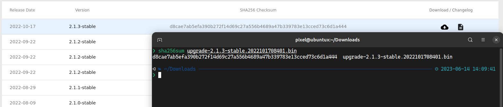

#### b)

There are three versions in the SHA family:

- **SHA1** produces a 160-bit checksum commonly used to verify data integrity and authenticate digital signatures.

- **SHA2** includes several hash functions that produce checksums of various lengths, from 224 bits to 512 bits.

- **SHA3** also includes multiple hash functions that generate checksums of various lengths from 224 bits to 512 bits.

The command above generated a 256-bit hash.

#### c)

SHA0  was found to be vulnerable to collision attacks as early as 1998, which allowed an attacker to generate two different messages with the same checksum. This vulnerability made SHA0 rather insecure and it was soon replaced by SHA1.

SHA1 was also found to be vulnerable to collision attacks, and is no longer recommended for use in security-related applications. Both SHA2 and SHA3 were developed al alternatives to SHA1.

#### d)

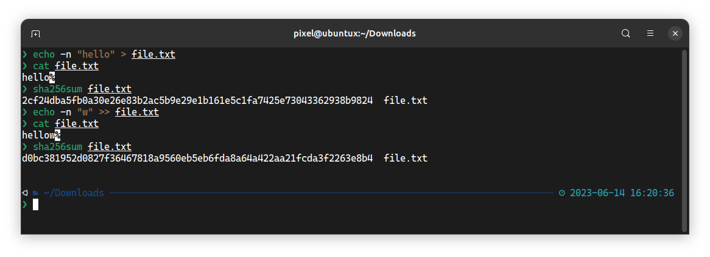

#### e)

No, SHA functions are one way, meaning that you get the ciphertext from a plaintext but not the other way around

## Part 2 - Symmetric Encryption with GPG

### exercise 2

#### a)

Here are the two main features of the key in symmetric encryption that make it tough to break:

- **Length**: A longer key indicates that an attacker would have to try more possible combinations, making a brute-force attack more time-consuming. For instance, cracking a 256-bit key would necessitate trying all 2256 potential keys, which is virtually difficult.
- **Randomness**: The encrypted data could display patterns that can be exploited to determine the key if the key is not random or is predictable. Because it assures that the key and the encrypted data don't have any obvious patterns that an attacker may use to figure out the key, randomization is a crucial component for safeguarding against statistical assaults.

#### b)

1. **Advanced Encryption Standard (AES)**: the key length can be 128, 192, or 256 bits.
1. **Blowfish**: the key length for Blowfish can range from 32 to 448 bits.
1. **RC4**: its key length for can range from 40 to 2048 bits.

#### c)

According to the `gpg --version` command, the supported symmetric encryption algorithms are IDEA, 3DES, CAST5, BLOWFISH, AES, AES192, AES256, TWOFISH, CAMELLIA128, CAMELLIA192 and CAMELLIA256.

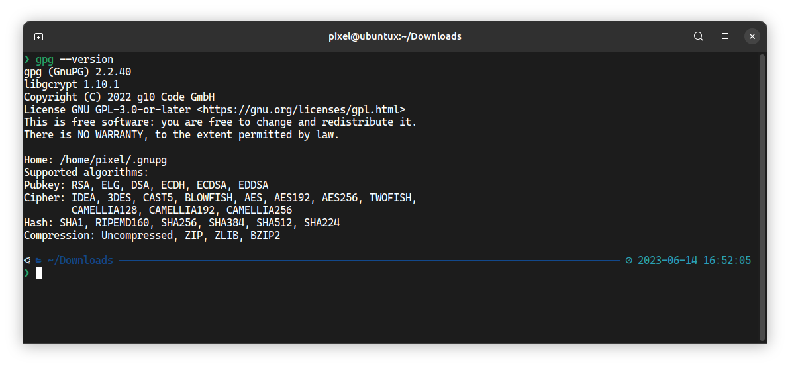

#### d)

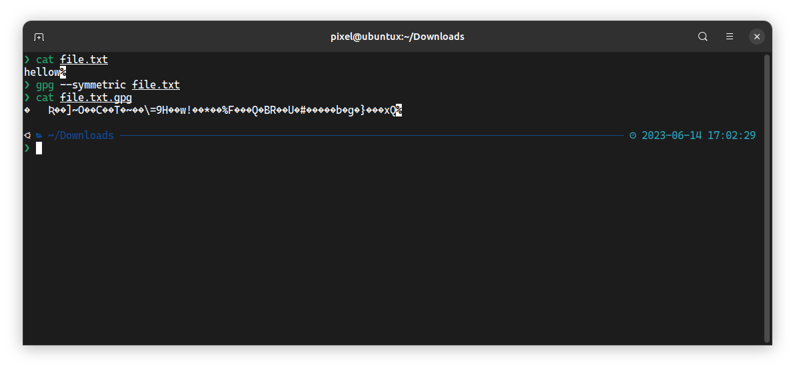

#### e)

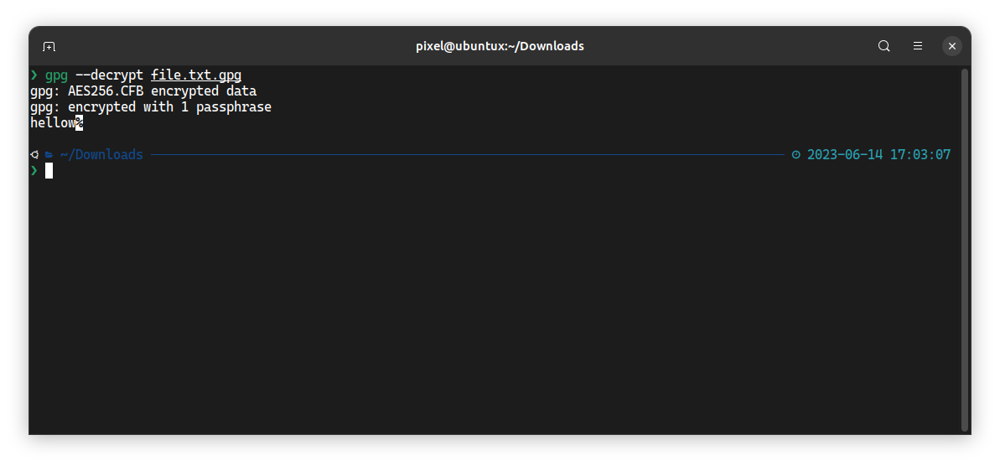

#### f)

The default symmetric cipher used is AES-128, but one can use the `--cipher-algo` to use another algorithm. Here is an example with CAMELLIA256:

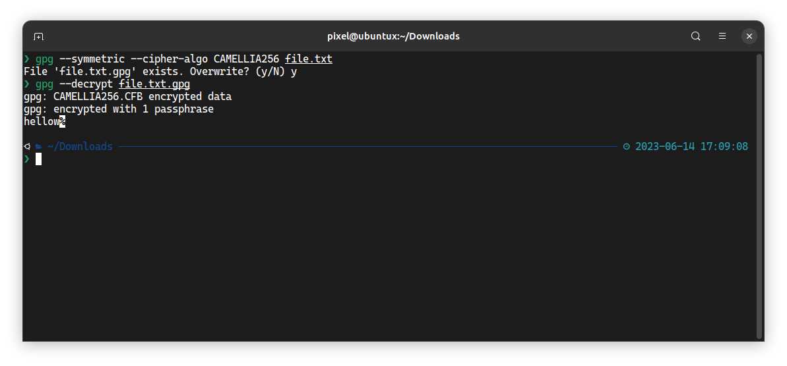

## Part 3 - Asymmetric Encryption with GPG

### exercise 3

#### a)

Using the command `gpg --list-keys` returns no keys on this system.

#### b)

Here is how I created the new keys:

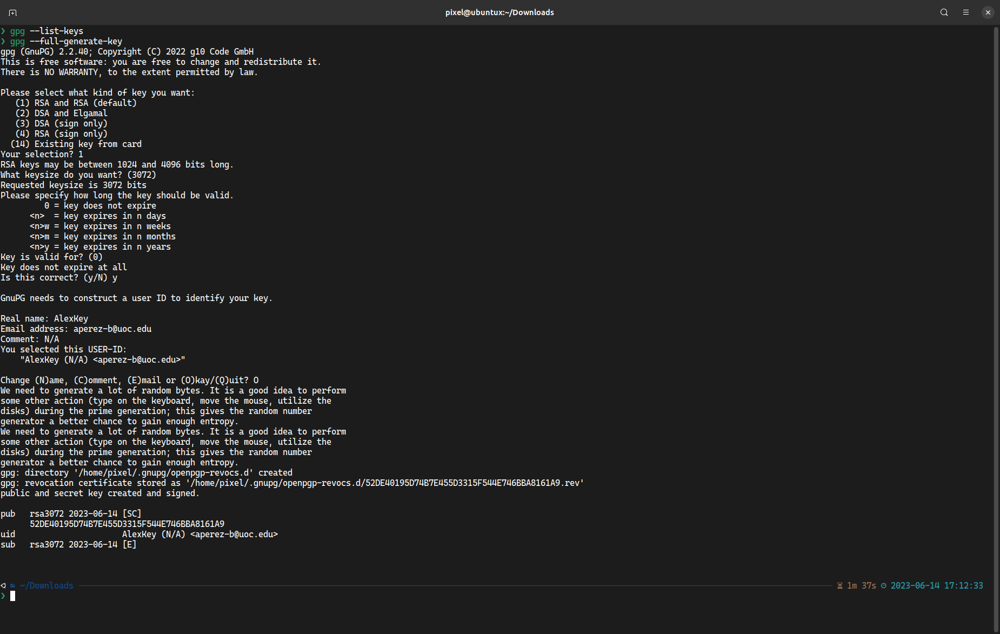

#### c)

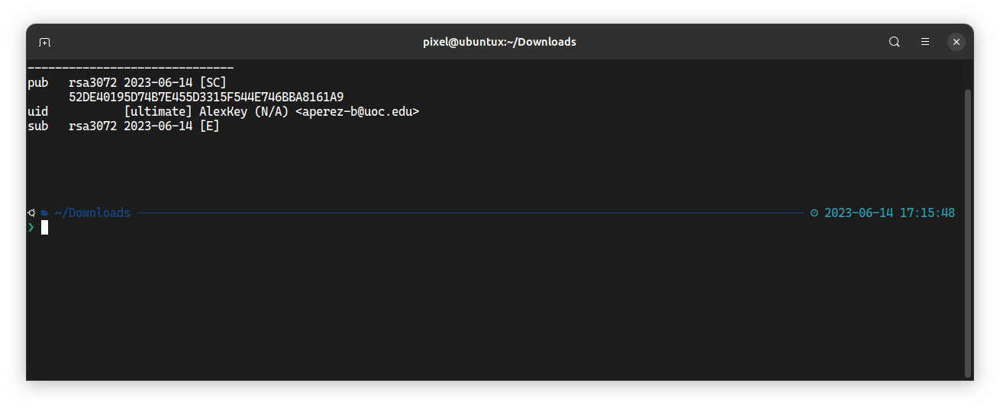

### exercise 4

#### a)

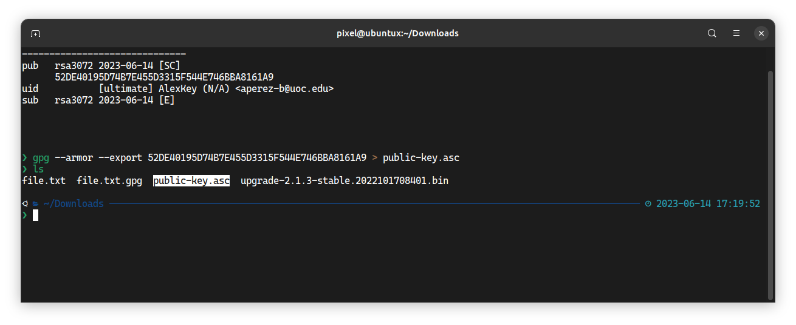

#### b)

Note: For this part I have worked individually, so I sent the public key to myself and worked with two machines.

### exercise 5

#### a)

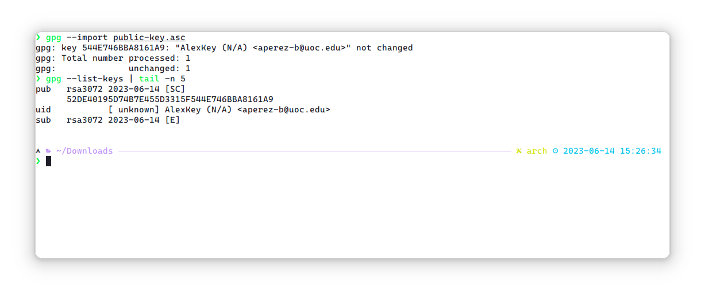

#### b)

See screenshot above

#### c)

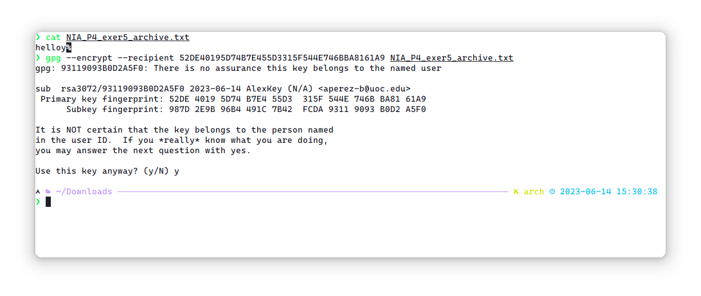

#### d)

Transferred encrypted file back to first machine (owner of the public key used for encryption)

### exercise 6

#### a)

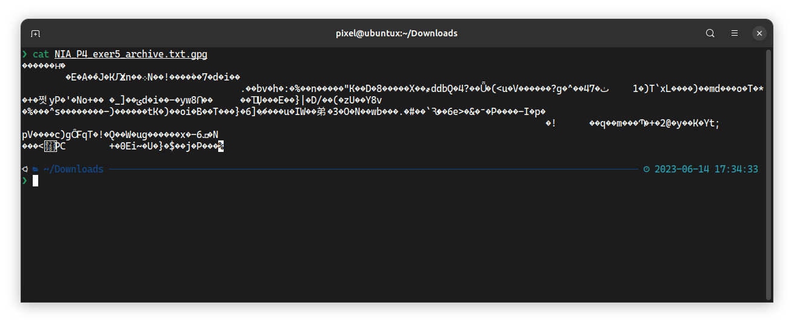

#### b)

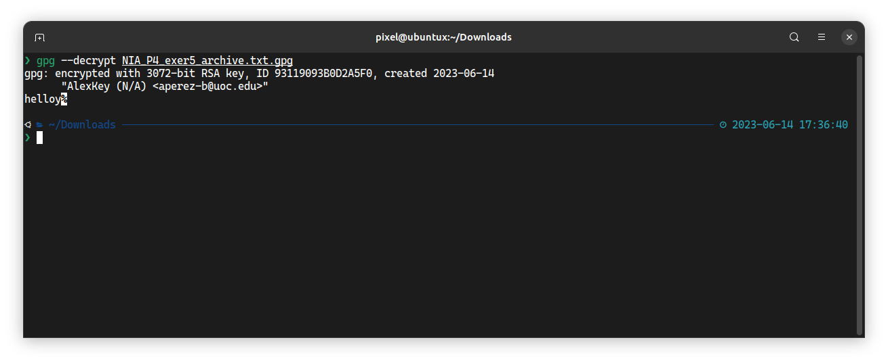

#### c)

From the screenshot above, you can see the plaintext `helloy`

### exercise 7

#### a)

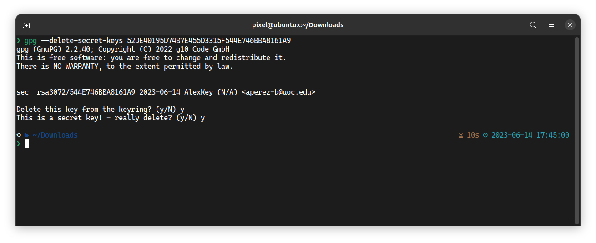

#### b)

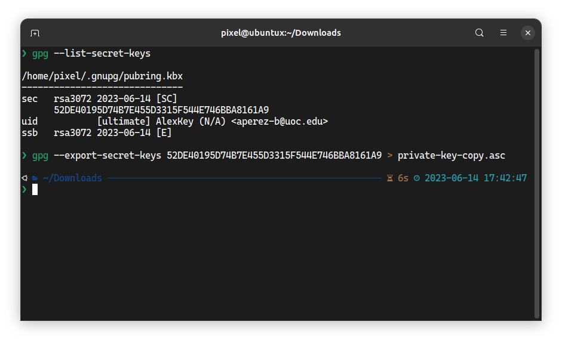

## Part 4 - Apache Setup

### exercise 8

#### a)

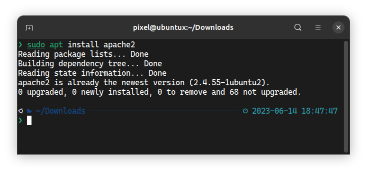

#### b)

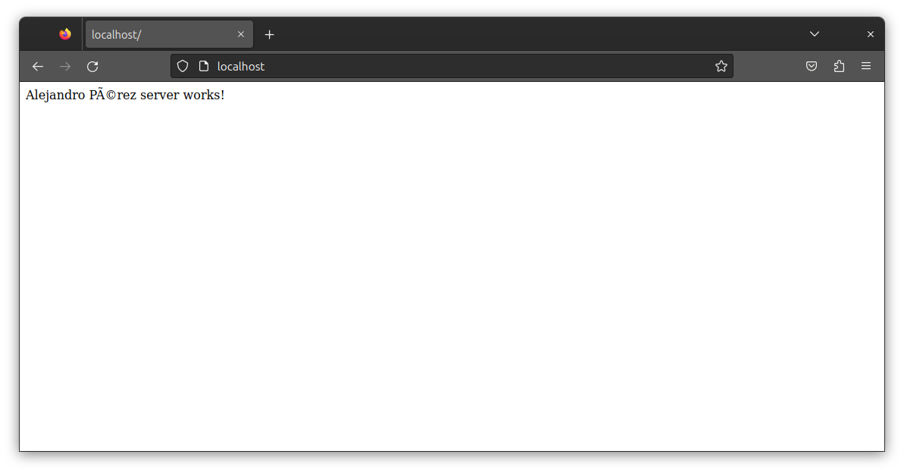

#### c)

- **SSLEngine**: enables the SSL/TLS encryption engine on the virtual host.
- **SSLCertificateFile**: specifies the path to the certificate file used to authenticate the server.
- **SSLCertificateKeyFile**: path to the private key file.
- **SSLCertificateChainFile**: path to the intermediate certificate file used to establish a chain of trust between the server's SSL/TLS certificate and a trusted root certificate.
- **SSLCACertificateFile**: path to the file that contains one or more trusted root certificates used to authenticate the client to the server.
- **SSLVerifyClient**: whether the server should request a client certificate for authentication.
- **SSLVerifyDepth**: maximum number of intermediate certificates allowed in a chain of trust between the client's certificate and a trusted root certificate.
- **SSLOptions**: various options that can be enabled, such as whether to require SSL/TLS encryption for all connections, whether to enable strict certificate checking, or whether to enable session caching.

#### d)

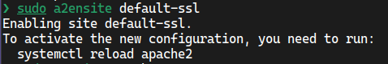

#### e)

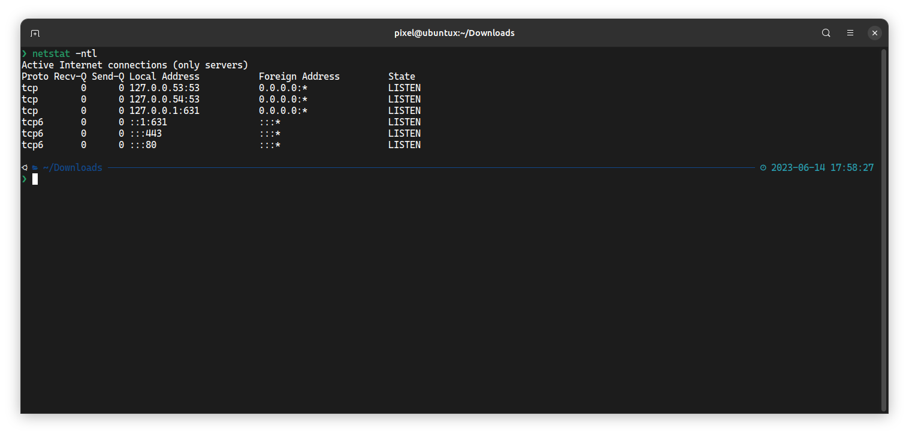

The second-to-last line in the output (the one with port 443) is the proof that HTTPS is enabled

### exercise 9

- **Protocol**: verison of the SSL/TLS protocol in use, e.g. "TLSv1.2" or "SSLv3".
- **Cipher**: shows that the current session uses symmetric encryption, e.g. "AES128-SHA". This element shows how data is encrypted or decrypted in the client and server.
- **Session-ID**: 32-byte random number used as an identifier for the TLS/SSL session, used to resume a previous session.
- **TLS session ticket**: alternative to the Session-ID to resume TLD/SSL sessions. The server generates a session ticket (encrypted with a shared key) for the client to save and he uses it to resume the session afterwards.

### Exercise 10

#### a)

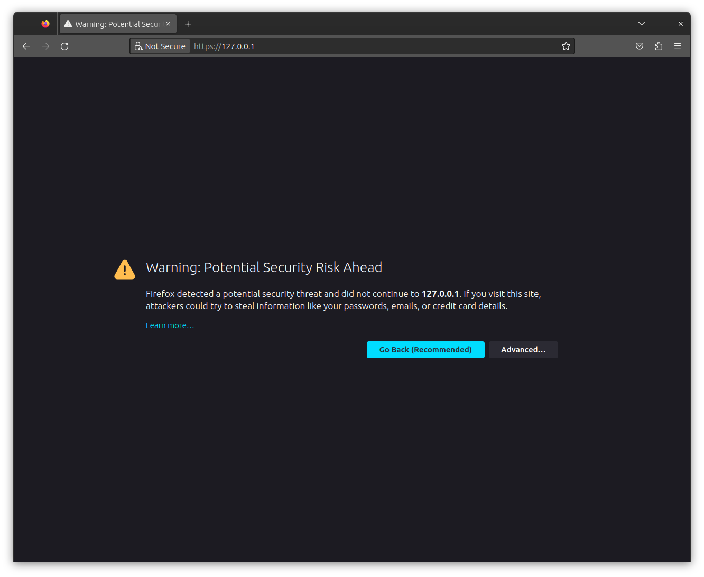

#### b)

The command connects to the server using OpenSSL and displays detailed information about the SSL/TLS connection, indicating the symmetric encryption algorithm being used for the current session.
The "Protocol" field in the output indicates the version of the SSL/TLS protocol that is being used for the current session. For example, the protocol field may show "TLSv1.2" or "TLSv1.3", and finally the "Certificate" field in the output indicates the SSL/TLS certificate that is being used for the current session.

#### c)

The three steps in the handshake are:

1. Client Hello: the client sends a "Client Hello" message to the server with information about the SSL/TLS version supported by the client, a list of supported cipher suites, and a random number generated by the client. This information is used by the server to find the best cipher suite and SSL/TLS version that both the client and server support.
1. Server Hello: The server responds with a "Server Hello" message with information about the SSL/TLS version and cipher suite selected by the server, a random number generated by the server, and the server's SSL/TLS certificate. The client uses the server's SSL/TLS certificate to authenticate the server and establish the connection.
1. Client Key Exchange and Change Cipher Spec: The client sends a "Client Key Exchange" message to the server with the client's public key, which is used to encrypt the session key. The client also sends a "Change Cipher Spec" message to the server saying that all subsequent messages will be encrypted using the agreed cipher suite and session key. Finally, the server responds with a "Change Cipher Spec" message of its own, saying that it is also ready.

June 14th, 2023
